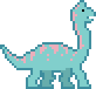
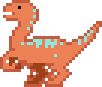
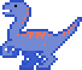
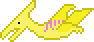
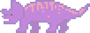
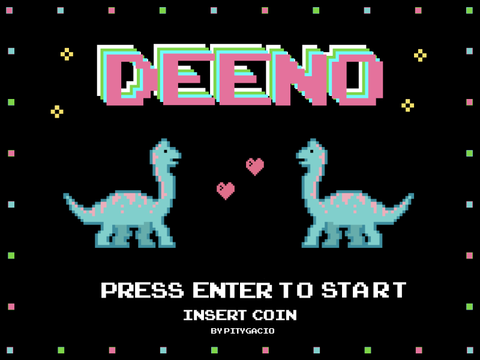

# DEENO

DEENO is a 2D runner 8 bit game, written in JavaScript using the [PixiJS library](https://pixijs.io).

Art was designed by myself, using [Pyxel Edit](https://pyxeledit.com).

Music by [Eric Matyas](www.soundimage.org).

## Playing

You play Deeno, a brachiosaurus trying to get home without being bitten by other fellow carnivores dinosaurs.

Deeno can duck with the down arrow key, and jump with the up arrow key (if pressed twice, it will jump higher).

The farthest Deeno goes on its journey, the higher score you get.

## Characters

Deeno the Brachiosaurus, it's cute.

Orange Velociraptor, it's mean.

Blue Velociraptor, it's fast.

Yellow Pterodactylus, it flies.

Purple Triceratops, it's chill.

## Title Screen

## Roadmap

- Animate characters
- Improve collisions
- High scores
- Make Deeno fire lasers from its eyes
- Increase difficulty over time
